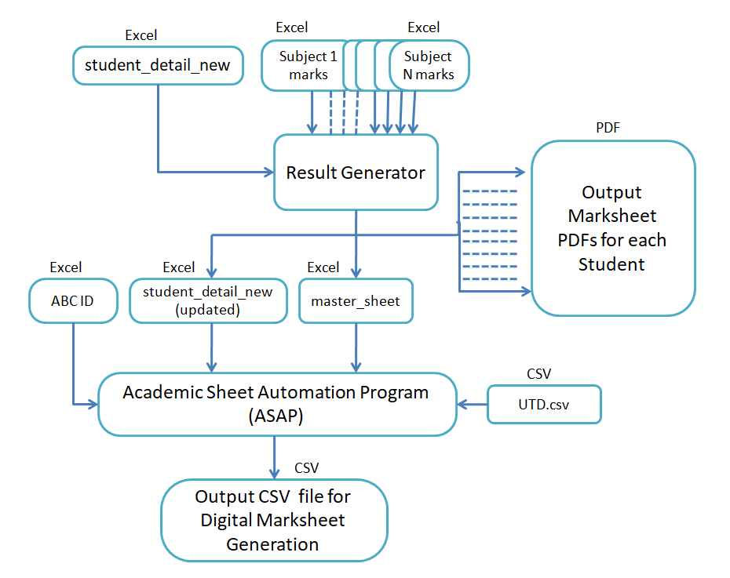

# Result Generator

This is a Python program with tkinter GUI that generates results of a complete class in just a few clicks. The user just has to select the path of student detail and subject marks excel sheets. Then this program generates PDFs of results in the destination folder. It is a convenient tool for teachers who want to generate results for a complete class quickly and efficiently.

## Follow these steps to generate results.
- Run the .exe file
  

- Select the *Student info sheet*.

  

- Select the *Subject Marks sheets* one by one.
  

- Update the date of results*.(*By default current date will be used.)


  
- Click on *Generate results* and select Destination folder.
- Check the message "results generated succesfully".
  

    if you get "ERROR" message read [Help Readme](https://github.com/ArpitMourya/Result_generator/blob/5unit_up/Help%20README.md) OR Click to HELP Button.

- Now Check the destination folder for results.
  

## Result Generation Flow


# Format of Excel sheets
- Student detail sheet
  [student_detail_new.xls](https://github.com/ArpitMourya/Result_generator/files/13350145/student_detail_new.xls)

- Subject marks Sheets
    [Student_marks.xls](https://github.com/ArpitMourya/Result_generator/files/13350182/Student_marks.xls)
# Result format
- code output
  [sample result.pdf](https://github.com/ArpitMourya/Result_generator/files/13350446/sample.result.pdf)
- After Print
  

## Authors

- [@ArpitMourya](https://www.github.com/ArpitMourya)
- [@PiyushPanday](https://www.linkedin.com/in/piyush-pandey-10812423a/)

## Building the .exe

- **Command:** 
    ```
    pyinstaller --onefile --windowed --exclude-module torch --exclude-module matplotlib --exclude-module numpy.f2py --upx-dir "C:\\Users\\Path_to_upx\\upx-5.0.2-win64" python_script.py
    ```

- **Arguments:**
  - `--onefile`: Produce a single bundled executable file.
  - `--windowed`: Build a GUI application without a console window.
  - `--exclude-module <module>`: Prevents PyInstaller from bundling the specified Python module(s) (useful to avoid packaging large or unnecessary libraries like `torch`, `matplotlib`, or `numpy.f2py`).
  - `--upx-dir <path>`: Path to the UPX binary to compress bundled executables.

- **Install UPX:** Download and install UPX (e.g. `upx-5.0.2-win64`) and provide its folder with `--upx-dir`. On Windows you can extract UPX and point to its folder, for example: `C:\Users\Path_to_upx\upx-5.0.2-win64`.

- **Resulting file:** The created executable will be placed in the `./dist/` folder as `python_script.exe` by default (i.e. `./dist/python_script.exe`). To name the file `output.exe`, add `--name output` to the command; the file will then be `./dist/output.exe`.

Be sure to run the command from your project folder (where `python_script.py` is located). If you need the executable for distribution, test it on a clean Windows environment.

---

## Notes
- If you want to change the Name of Course in UTD.csv Output file for Digital Marksheet Generation, Change the `course name` field in the [./student_detail_new.xls](./student_detail_new.xls) file.