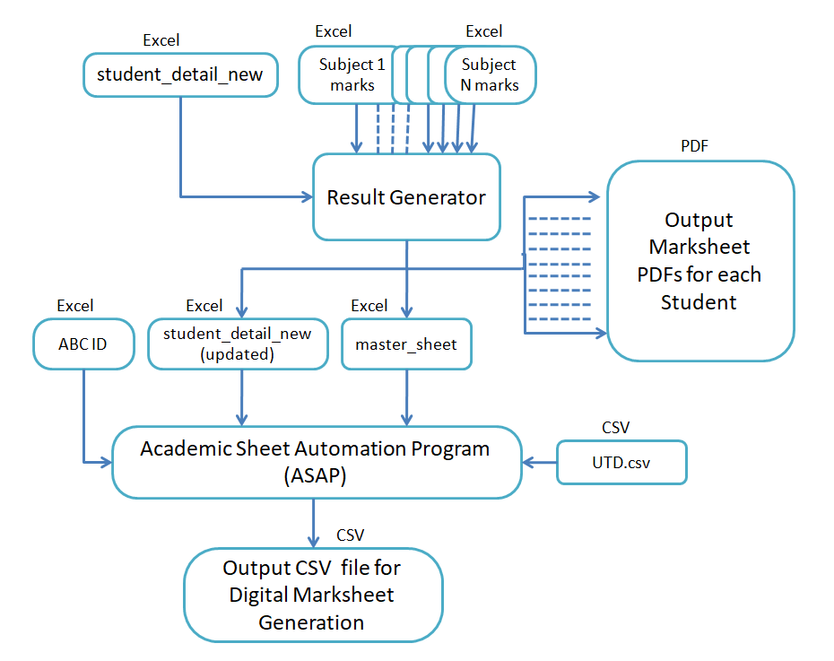

# Result Generator Software

Result Generator Software is an automation tool to generate Result & Marksheet for *School of Instrumentation, DAVV*. This tool is created using Python and tkinter GUI that generates results of a complete class in just a few clicks. The user just has to select the path of student detail and subject marks excel sheets ( example `test_input_files/`). Then this program generates **Marksheet PDF** for each student with their respective subject grades and previous semester SGPA, along with a **Master Sheet** which contains grades of all students for all subjects for that particular semester. Further this tool also updates input student detail excel sheet with current semester results which is required to generate result for the next semester. All output files will be stored in selected destination folder (example `test_output_files`). It is a convenient tool for teachers who want to generate results for a complete class quickly and efficiently.

## Follow these steps to generate results.
- Run the .exe file
  

*Student info sheet*.

  

- Select the *Subject Marks sheets* one by one.
  

- Update the date of results*.(*By default current date will be used.)


  
- Click on *Generate results* and select Destination folder.
- Check the message "results generated succesfully".
  

    if you get "ERROR" message read [Help Readme](https://github.com/ArpitMourya/Result_generator/blob/5unit_up/Help%20README.md) OR Click to HELP Button.

- Now Check the destination folder for results.
  

## Result Generation Flow


# Format of Excel sheets
- Student detail sheet
  [student_detail_new.xls](https://github.com/ArpitMourya/Result_generator/files/13350145/student_detail_new.xls)

- Subject marks Sheets
    [Student_marks.xls](https://github.com/ArpitMourya/Result_generator/files/13350182/Student_marks.xls)
# Result format
- code output
  [sample result.pdf](https://github.com/ArpitMourya/Result_generator/files/13350446/sample.result.pdf)
- After Print
  

## Authors

- [@ArpitMourya](https://www.github.com/ArpitMourya)
- [@PiyushPanday](https://www.linkedin.com/in/piyush-pandey-10812423a/)

## Install Requirements

- Install required Python packages listed in `requirements.txt`:

```
pip install -r requirements.txt
```

## Building the .exe

- **Command:** 
    ```
    pyinstaller --onefile --windowed --exclude-module torch --exclude-module matplotlib --exclude-module numpy.f2py --upx-dir "C:\\Users\\Path_to_upx\\upx-5.0.2-win64" python_script.py
    ```

- **Arguments:**
  - `--onefile`: Produce a single bundled executable file.
  - `--windowed`: Build a GUI application without a console window.
  - `--exclude-module <module>`: Prevents PyInstaller from bundling the specified Python module(s) (useful to avoid packaging large or unnecessary libraries like `torch`, `matplotlib`, or `numpy.f2py`).
  - `--upx-dir <path>`: Path to the UPX binary to compress bundled executables.

- **Install UPX:** Download and install UPX (e.g. `upx-5.0.2-win64`) and provide its folder with `--upx-dir`. On Windows you can extract UPX and point to its folder, for example: `C:\Users\Path_to_upx\upx-5.0.2-win64`.

- **Resulting file:** The created executable will be placed in the `./dist/` folder as `python_script.exe` by default (i.e. `./dist/python_script.exe`). To name the file `output.exe`, add `--name output` to the command; the file will then be `./dist/output.exe`.

Be sure to run the command from your project folder (where `python_script.py` is located). If you need the executable for distribution, test it on a clean Windows environment.

---

## Notes
- If you want to change the Name of Course in UTD.csv Output file for Digital Marksheet Generation, Change the `course name` field in the [./student_detail_new.xls](./student_detail_new.xls) file.

## Data structures (variables) used in the code

The code stores per-semester and per-student values in **Lists** named by semester index `X` where `X` ranges from 1 to 10:

- `credit_sem_X`: Total Credits (sum of all subject credits) for semester `X` (element datatype: `int`).
- `student_sem_X`: SGPA for semester `X` for each student (element datatype: `float`).
- `attempt_sem_X`: Total number of attempts for the main examination in semester `X` for each student (element datatype: `int`).
- `result_sem_X`: Result for semester `X` for each student — one of `PASS`, `ATKT`, `FAIL` (element datatype: `str`).


Input Excel workbook variables used in the code:

- `wb_student_details`: Python variable for the input Excel file `student_details_new.xls` (student detail sheet).
- `wb_subject`: Python variable for the input Excel file `Student_Marks.xls` (subject marks sheets).

Subject metadata stored by the program (per subject lists):

- `subject_code`: Subject code for each subject (list of `str`).
- `subject_name`: Subject name for each subject (list of `str`).
- `course_credits`: Credits for each subject (list of `int`).
- `subjects_grades`: subjects_grades is a list of list, where each inner list contains the grades of all students for a particular    subject. So
  - `subjects_grades[n]` gives the list of grades of all students for the **"nth"** subject, and 
  - `subjects_grades[n][k]` gives the grade of the **"kth"** student in the "nth" subject. 
  - **"n"** represents the subject index and **"k"** represents the student index.

## ReportLab Canvas units

- 1 inch = 2.54 cm = 72 points
- 1 cm ≈ 28.346 points
- 1 point ≈ 0.0353 cm

These conversions are useful when positioning elements on the ReportLab `Canvas` (the code uses point units internally; constants are provided in the source to convert millimetres to points).

## ATKT Examination Marksheet Generation Rules (Marking in Subject Excel sheets)

- Write `ATKT` (or `ATKT2`, `ATKT3`, etc. Maximum `ATKT9` is acceptable) in the last column of the subject Excel sheet, in front of each student who has an ATKT for that subject.
- Meaning of values in the last column:
  - Blank -> 1st Examination (Main) attempt
  - `ATKT` -> 2nd Examination attempt
  - `ATKT2` -> 3rd Examination attempt
  - `ATKT3` -> 4th Examination attempt
- Rules and notes:
  - Either leave the last column blank (for main attempt) or use a single ATKT level like `ATKT`/`ATKT2` for ATKT students — do not mix different ATKT levels within the same subject sheet.
  - Across different subject sheets you should also avoid inconsistent mixes of ATKT levels for the same exam batch (for example, prefer the same attempt-level convention across files).
